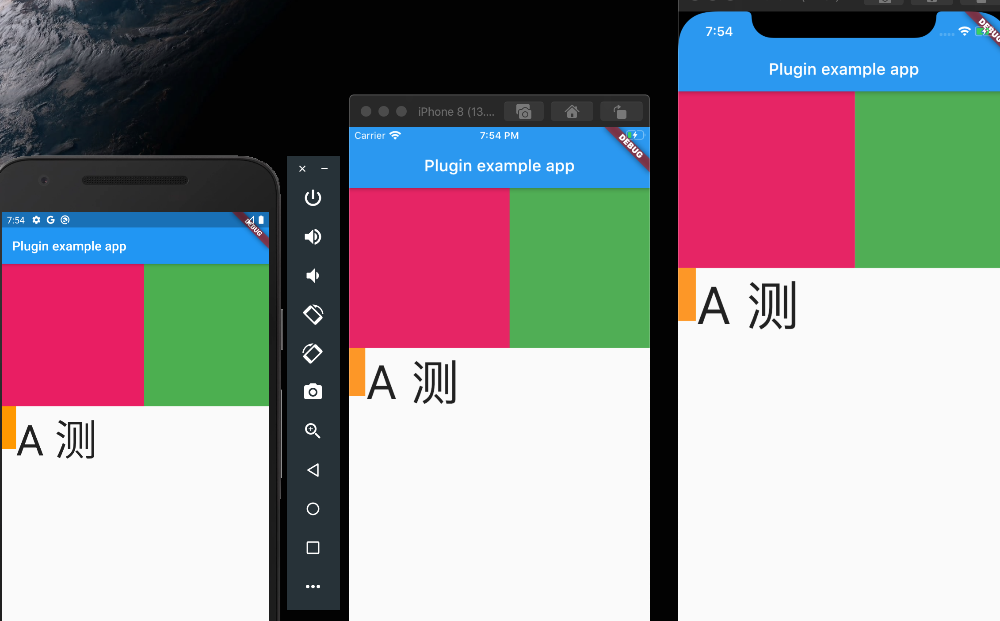

# sf

A Flutter screen fit plugin.

## 效果图




##  使用

    1、依赖
    在pubspec.yaml里添加
    sf: ^0.0.1

    2、使用

````dart

///初始化 
///sf.init(context).fit(设计稿宽度, 设计稿高度)
sf.init(context).fit(375, 1440);

///适配宽度高度
/// Dp 提供 0-375 的默认值，如果需要可以自己填写
/// eg:sf.dp(10.0)
sf.dp(Dp.$200)


///适配字文字
/// Sp 默认提供 5-60 常用值，如果需要可以自行填写
/// eg:sf.sp(12.0)
sf.sp(Sp.$60)


````